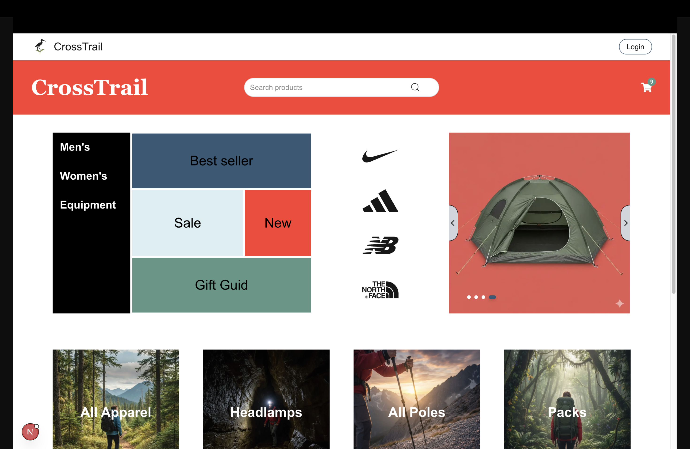
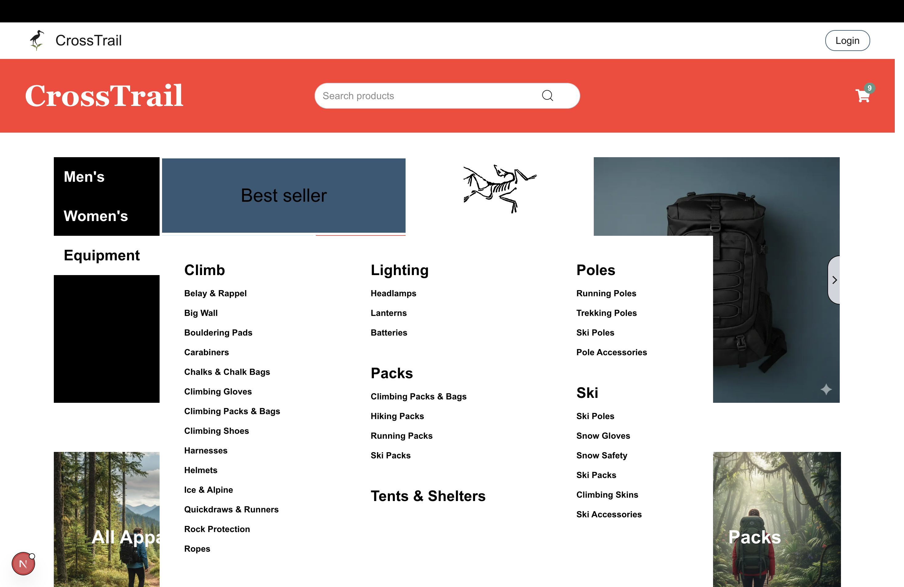
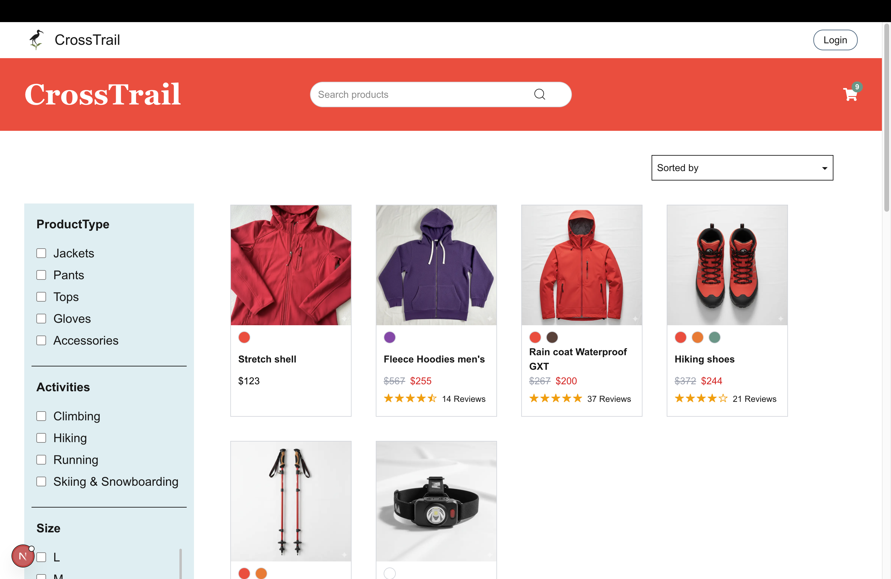
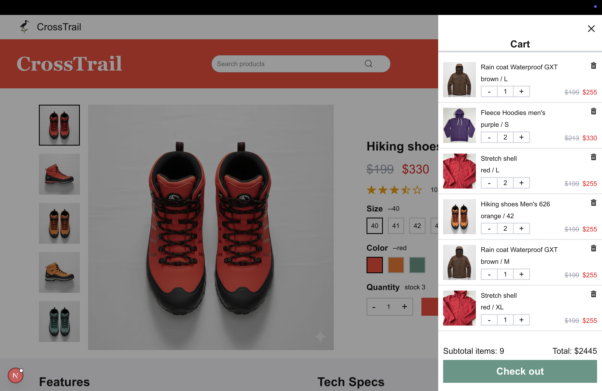

This is a [Next.js](https://nextjs.org) project bootstrapped with [`create-next-app`](https://nextjs.org/docs/app/api-reference/cli/create-next-app).

# Modern E-Commerce Frontend (Next.js)

A modern e-commerce frontend application focusing on interactive UI,
responsive layout, and scalable component architecture.

This project emphasizes real-world front-end challenges such as
overlay management, complex layouts, and cross-component state coordination.

## Preview

  
More Screens

  
  
  ！[Checkout Page](./screenShots/checkoutPage.png)

## Why This Project

This project combines technical exploration with personal interest.  
As someone who enjoys hiking and outdoor activities, building an outdoor gear e-commerce website felt like a natural and motivating domain.

The project focuses on applying modern React and Next.js patterns to real-world e-commerce challenges, including semantic HTML for SEO and accessibility, image-heavy product pages, variant selection, reviews, and checkout flows.

By grounding the implementation in a familiar domain, the project emphasizes long-term maintainability, interaction correctness, and production-ready UI architecture.

## Features

- Animated category drawer with overlay and background lock
- Uses semantic HTML structure (main, section, article, dl, figure) for improved SEO and accessibility
- Interactive product cards with hover effects
- Image carousel with navigation controls
- Responsive grid and layout system
- Click-through handling for layered absolute elements
- Checkout flow with order summary, quantity control, and cart integration
- Cross-component UI state management using React Context

## Architectural Notes

- Uses Next.js App Router for scalable routing structure
- Drawer state shared across components via React Context
- Carefully manages z-index and pointer events to avoid interaction conflicts
- Avoids layout collapse by explicitly handling flex-shrink and absolute positioning
- Ensures hydration consistency by avoiding non-deterministic render logic

## Future Improvements

- Product data integration from backend APIs
- Accessibility improvements (ARIA, keyboard navigation)
